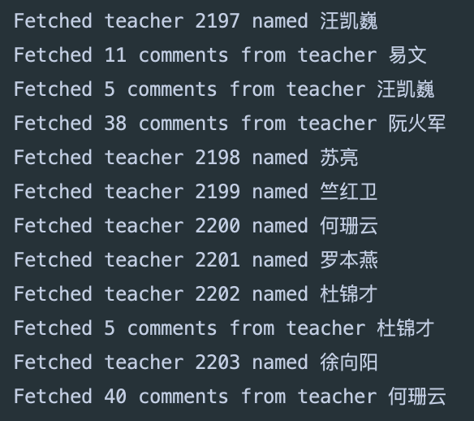
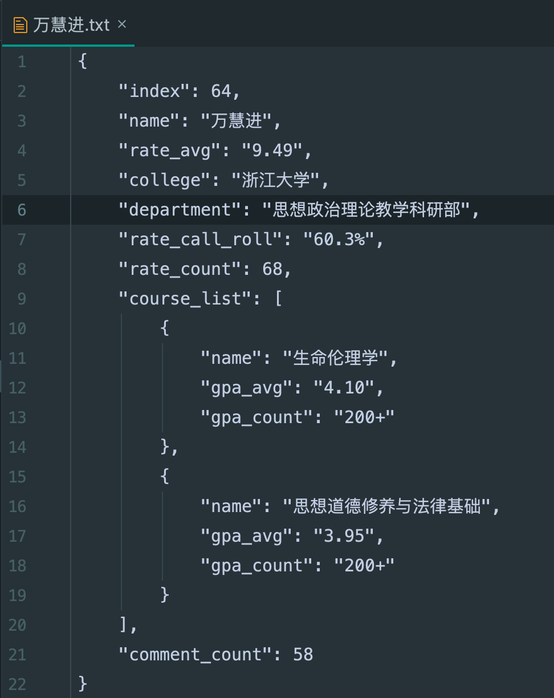
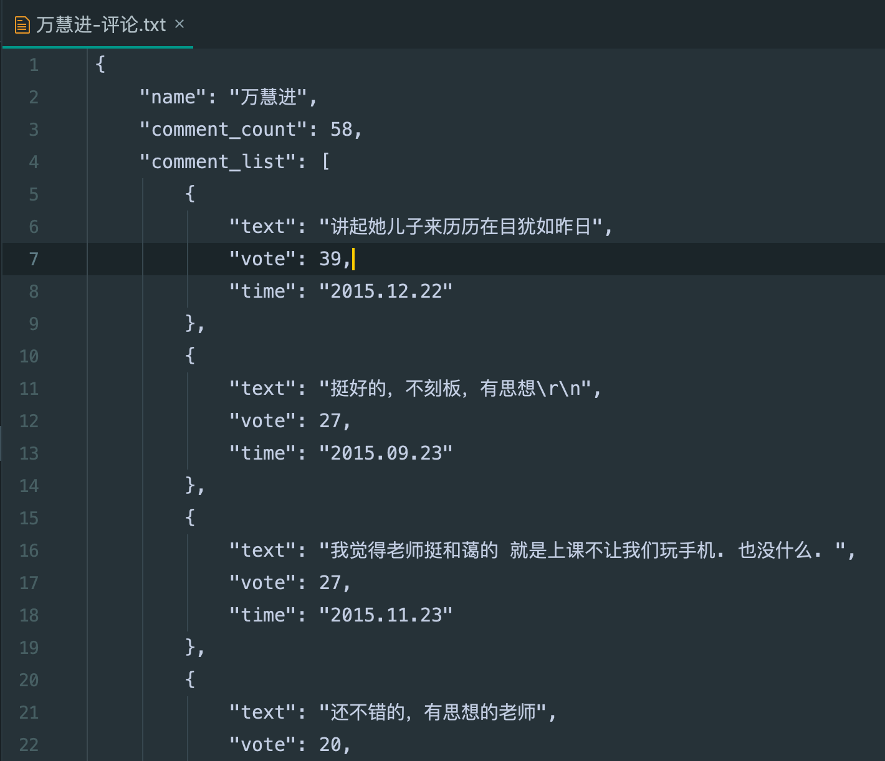

# 查老师爬虫

[查老师](chalaoshi.cn)是浙江大学的一个教师匿名评论平台。

这是一个基于Scrapy爬取查老师网页信息的Python爬虫项目。

信息爬取后，以txt文本格式保存在本地`chalaoshi/data/`文件夹下。

目前查老师尚未设置反爬虫策略，目前的代码足以爬取全部信息。
如果出现无法爬取的情况可以邮件联系本人：lilq1285@163.com

***代码仅供学习参考，数据可供本地查询检索、或作分析学习用途。***

## 爬取信息

### 老师信息

- 编号（从1到5215的整数）
- 姓名
- 评分（0-10的2位小数或者'N/A'的字符串）
- 学校（一般为浙江大学）
- 部门
- 点名率（含百分号的字符串）
- 评分人数（非负整数）
- 课程列表（列表）
  - 课程
    - 课程名
    - 课程均绩
    - 均绩统计人数
- 评论人数（非负整数）

### 评论

- 姓名（对应的老师姓名）
- 评论个数（非负整数）
- 评论列表（列表，按点赞从高到低排列）
  - 评论
    - 内容（字符串）
    - 点赞个数（任意整数）
    - 时间戳（格式为`yyyy.mm.dd`）

截止2019年5月14日，[查老师](chalaoshi.cn)网站一共登记5215个老师，从1开始连续编号。

## 运行方式

请确保你的python3环境包含scrapy库（版本1.5.1）。

### 命令行执行

1. 进入`data`文件夹所在目录，执行语句`scrapy crawl chalaoshi`

2. 也可以执行`python3 main.py`

### 其他方式

可在PyCharm等IDE中执行`main.py`。

**支持断点续爬，已爬取的教师信息将会保存在save_records文件中。**

可在`settings.py`修改`DOWNLOAD_FOLDER`（文件下载目录），`SAVE_FILE`（已经爬取的信息目录），`MAX_INDEX`（教师的编号最大值）等字段进行自定义操作。

## 过程截图

### 运行过程

### 老师信息

### 评论内容

